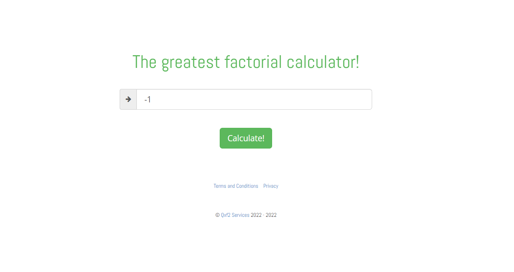

[AQAFactorailCalculator] Enter minus number

Steps
1. Entere minus number
2. Click Calculate! button

Actaul Result (bug)

 The application does not return an answer

Expected Result(correct)

 The application should return error message for example : "Please enter a number great than 0", with red color shrifts 
 also the text field should be highlighted in red.

