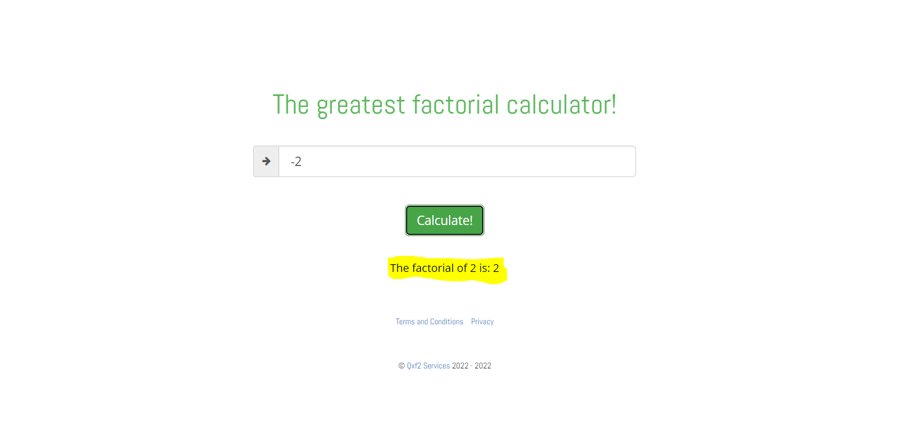

[AQAFactorailCalculator] Result Field can not reset

Steps
1. Enter "2" in the Input Field
2. Click Calculate! button
3. Then enter "-2" in the input Field
4. Click Calculate! button

Actaul Result(bug)

 The application is still showing the previos answer. Nothing changed.

Expected Result(correct)

 The answer field first should be reset for -2 calculation and proper error message should return.

